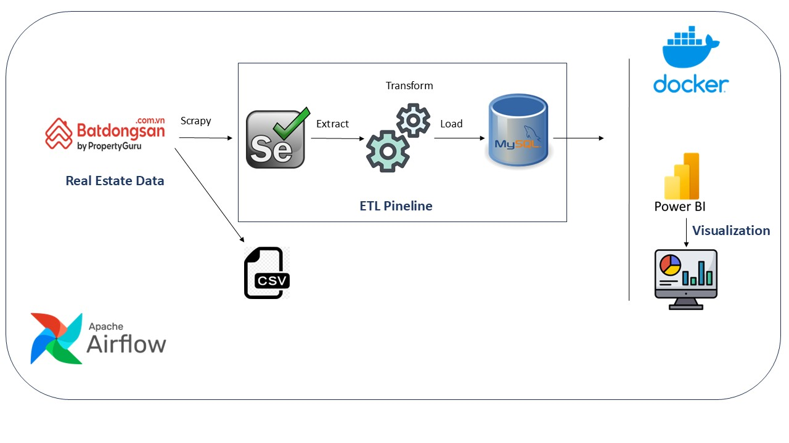

# Automated ETL and Visualization of Real Estate Using Airflow and Apache Superset

## Table of Contents

- [Introduction](#introduction)
- [Features](#features)
- [Technologies Used](#technologies-used)
- [Setup Instructions](#setup-instructions)
- [Data Pipeline](#data-pipeline)
- [Usage](#usage)
- [Visualizations](#visualizations)
- [Conclusion](#concly)
- [Future Direction](#Future_Direction)

## Introduction

This project aims to automate the process of extracting, transforming, and loading (ETL) Real Estate in Ho Chi Minh City, Viet Nam, then storing them in a MySQL database, and visualizing the data using Power BI. The entire ETL workflow is managed by Apache Airflow, ensuring a scalable and reliable data pipeline.
## Features
- **Web Srapy:** Using Selenium to get data from website, store in MySQL as datalake
- **Automated ETL Pipeline**: Using Apache Airflow to automate the process of collecting data, extracting and transforming into a usable format, and loading into a MySQL database. 
- **Data Visualization**: Leveraging Power BI to create interactive dashboards and visualizations for analyzing Real Estate market.
- **Docker Compose Setup**: The project uses Docker Compose to streamline the deployment and management of the required services, including Apache Airflow, MySQL, and Power BI.
## Technologies Used
- **Selenium** : For web scrapy
- **Apache Airflow**: For managing and scheduling ETL workflows.
- **MySQL**: To store transformed match results data.
- **Power BI**: For creating and managing data visualizations.
- **Docker Compose**: To orchestrate the deployment of the above technologies.

## Data Pipeline

- **Scrapy**: Collects data from the Batdongsan.com.vn website on using Selenium and stores it in a csv file.
- **Transformation**: Data is cleaned and transformed into a format suitable for analysis.
- **Loading**: Transformed data is loaded into a MySQL database for further analysis.
- **Scheduling**: Airflow schedules regular updates of the data pipeline.
- **Analysis**: Analyzes the Real Estate data up to the current matches, providing detailed information..

## Usage
### Raw Data

### Transformed Data

### Dashboard Power BI

## Conclusion
- The purpose of this project is to utilize ETL processes to continuously collect and update match results. This enables comprehensive analysis of the real estate market, providing an up-to-date overview of the current matches.
## Future Direction
- I aims to gather additional data encompassing more detailed information. This will allow us to create more in-depth analytical charts and insights.
## Contact

For any questions or feedback, please reach out to [nguyenthihongthi.230502@gmail.com](mailto:nguyenthihongthi.230502@gmail.com).

   
